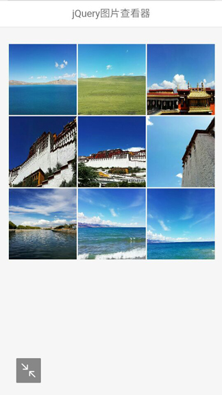
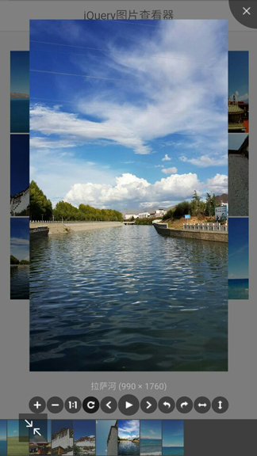
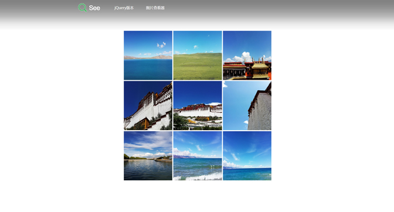
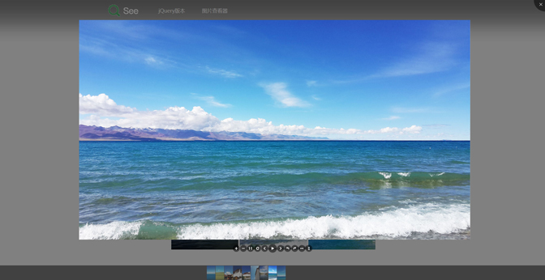

# Viewerjs jQuery图片查看器
## 更新
### Viewer.js 有以下特点：
- 支持移动设备触摸事件
- 支持响应式
- 支持放大/缩小
- 支持旋转（类似微博的图片旋转）
- 支持水平/垂直翻转
- 支持图片移动
- 支持键盘
- 支持全屏幻灯片模式（可做屏保）
- 支持缩略图
- 支持标题显示
- 支持多种自定义事件

## 使用方法
### 载入 CSS 文件
```CSS
<link rel="stylesheet" type="text/css" href="css/reset.css"/>
<link rel="stylesheet" type="text/css" href="css/viewer.min.css">
<link rel="stylesheet" type="text/css" href="css/mobie.css"/>
```

### DOM底部载入 JavaScript 文件
```JavaScript
<script type="text/javascript" src="js/common.js"></script>
<script type="text/javascript" src="js/jquery-1.12.3.js"></script>
<script type="text/javascript" src="js/viewer-jquery.min.js"></script>
```

### DOM 结构
```html
<ul class="images clearfix" id="dowebok">
    <li class="item"></li>
    <li class="item"></li>
    <li class="item"></li>
    <li class="item"></li>
    <li class="item"></li>
    <li class="item"></li>
    <li class="item"></li>
    <li class="item"></li>
    <li class="item"></li>
</ul>
```
### 调用 Viewer
```javascript
 $('#dowebok').viewer({
    url: 'data-original'
 });
```
## 常用配置 Common API 
			

| Name 名称    | Type 类型  | Default 默认值| Description 说明|
| ------------ | ------- | ------- | ----------- |
| inline | 布尔值 | false | 启用 inline 模式 |
| button | 布尔值 | true | 显示右上角关闭按钮（jQuery 版本无效） |
| navbar | 布尔值/整型 | true | 显示缩略图导航 |
| title | 布尔值/整型 | true | 显示当前图片的标题（现实 alt 属性及图片尺寸） |
| toolbar | 布尔值/整型 | true | 显示工具栏 |
| tooltip | 布尔值 | true | 显示缩放百分比 |
| movable | 布尔值 | true | 图片是否可移动 |
| zoomable | 布尔值 | true | 图片是否可缩放 |
| rotatable | 布尔值 | true | 图片是否可旋转 |
| scalable | 布尔值 | true | 图片是否可翻转 |
| transition | 布尔值 | true | 使用 CSS3 过度 |
| fullscreen | 布尔值 | true | 播放时是否全屏 |
| keyboard | 布尔值 | true | 是否支持键盘 |
| interval | 整型 | 5000 | 播放间隔，单位为毫秒 |
| zoomRatio | 浮点型 | 0.1 | 鼠标滚动时的缩放比例 |
| minZoomRatio | 浮点型 | 0.01 | 最小缩放比例 |
| maxZoomRatio | 数字 | 100 | 最大缩放比例 |
| zIndex | 数字 | 2015 | 设置图片查看器 modal 模式时的 z-index |
| zIndexInline | 数字 | 0 | 设置图片查看器 inline 模式时的 z-index |
| url | 字符串/函数 | src | 设置大图片的 url |
| build | 函数 | null | 回调函数，具体查看演示 |
| built | 函数 | null | 回调函数，具体查看演示 |
| show | 函数 | null | 回调函数，具体查看演示 |
| shown | 函数 | null | 回调函数，具体查看演示 |
| hide | 函数 | null | 回调函数，具体查看演示 |
| hidden | 函数 | null | 回调函数，具体查看演示 |
| view | 函数 | null | 回调函数，具体查看演示 |
| viewed | 函数 | null | 回调函数，具体查看演示 |

## 移动端效果如下图所示：

<p align="left">
  
  <span>&nbsp;&nbsp;&nbsp;&nbsp;</span> 
  
</p>

## pc端效果如下图所示：

<p align="center">
  
</p>
<p align="center">
  
</p>

** [⬆ 回到顶部](#更新) **
